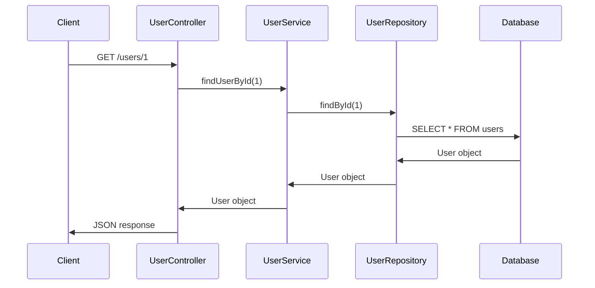

# CSA (Code Static Analyzer) for Spring Boot

> Spring Boot 기반 Java 애플리케이션을 자동으로 정적 분석하여 **코드 구조, 데이터베이스 호출 관계, 시퀀스 다이어그램**을 생성하는 도구입니다.


---

## 🎯 주요 기능

### 1. **Java 코드 정적 분석**
- 패키지, 클래스, 메서드, 필드, 내부 클래스 자동 추출
- Spring Bean, REST Endpoint, Lombok, Config 클래스 식별
- 메서드 호출 관계 추적

### 2. **Spring Boot 특화 분석**
- `@Component`, `@Service`, `@Repository`, `@Controller`, `@RestController` 자동 감지
- `@Autowired`, Constructor/Setter/Field Injection 의존성 추적
- `@RequestMapping`, HTTP 메서드 기반 Endpoint 매핑

### 3. **JPA & MyBatis 통합**
- JPA 엔티티, 레포지토리, 쿼리 자동 추출
- MyBatis 매퍼 및 SQL 문 파싱
- SQL-테이블 매핑 관계 추출

### 4. **데이터베이스 분석**
- DDL (CREATE TABLE, ALTER, CREATE INDEX) 파싱
- Database, Table, Column, Index, Constraint 메타정보 추출
- Method → SQL → Table 호출 체인 추적

### 5. **시각화 & 리포트**
- PlantUML / Mermaid 시퀀스 다이어그램 자동 생성
- CRUD 매트릭스 (클래스 × 테이블 기준)
- DB 호출 체인 다이어그램 및 영향도 분석
- 이미지 변환 (PNG/SVG/PDF) 지원

### 6. **그래프 데이터베이스 저장**
- Neo4j를 활용한 모든 분석 결과 저장
- 복잡한 관계 쿼리를 통한 강력한 분석 가능
- Neo4j 브라우저에서 시각적 탐색 가능

---

## 📊 분석 결과 예시

### 호출 체인 다이어그램
```
UserController.getUser()
  └─→ UserService.findUserById()
       └─→ UserRepository.findById()
            └─→ SELECT * FROM users WHERE id = ?
                 └─→ SQL: users 테이블 조회
```

### CRUD 매트릭스
| 클래스 | users | orders | products |
|--------|-------|--------|----------|
| UserController | R | R | R |
| OrderService | | CRU | RU |
| ProductService | | | CRUD |

### 시퀀스 다이어그램 (Mermaid 형식)


---

## 🚀 빠른 시작 (5분)

### 1️⃣ 설치

```bash
# 저장소 클론
git clone <repository-url>
cd lang-parser-springboot

# 가상환경 생성 및 활성화
python -m venv .venv
.venv\Scripts\activate          # Windows
# source .venv/bin/activate     # Linux/Mac

# 의존성 설치
pip install -r requirements.txt
```

### 2️⃣ 환경 설정

```bash
# env.example을 참고하여 .env 파일 생성
cp env.example .env
```

`.env` 파일에 다음을 입력하세요:
```
NEO4J_URI=neo4j://127.0.0.1:7687
NEO4J_DATABASE=csadb01
NEO4J_USER=csauser
NEO4J_PASSWORD=csauser123

JAVA_SOURCE_FOLDER=D:\path\to\your\project\src\main\java
DB_SCRIPT_FOLDER=D:\path\to\your\project\src\main\resources\db

LOG_LEVEL=INFO
```

### 3️⃣ 분석 실행

```bash
# 전체 프로젝트 분석 (Java + DB)
python -m csa.cli.main analyze --all-objects --clean --project-name myproject

# 결과 확인 (Neo4j 브라우저)
# http://localhost:7474
```

### 4️⃣ 시각화 생성

```bash
# 시퀀스 다이어그램 생성
python -m csa.cli.main sequence --class-name UserController --format mermaid

# CRUD 매트릭스 생성
python -m csa.cli.main crud-matrix --project-name myproject

# 결과 위치: output/sequence-diagram/, output/crud-matrix/
```

---

## 📦 프로젝트 구조

```
csa/
├── cli/                      # CLI 진입점 및 명령어 핸들러
│   └── commands/             # analyze, sequence, crud 등 각 명령어
├── services/
│   ├── analysis/             # Java/DB 파이프라인 오케스트레이션
│   ├── java_analysis/        # Spring/JPA/MyBatis 파서
│   ├── graph_db/             # Neo4j CRUD 및 분석 쿼리
│   └── db_call_analysis/     # 호출 체인, CRUD 매트릭스, 다이어그램
├── models/                   # Pydantic 데이터 모델 및 그래프 엔티티
├── parsers/                  # 저수준 파싱 엔진 (Java/DB/SQL)
├── diagrams/                 # PlantUML/Mermaid 시퀀스 다이어그램 생성
├── utils/                    # 로거, 규칙 매니저, 유틸리티
└── vendor/javalang/          # Java AST 파싱 라이브러리

tests/
├── unit/                     # 단위 테스트
├── integration/              # 통합 테스트 (엔드-투-엔드)
├── contract/                 # CLI 인터페이스 테스트
├── sample_java_project/      # 테스트용 Java 샘플
└── sample_jpa_project/       # JPA 테스트 샘플

rules/                        # 논리명/설명 추출 규칙 (Markdown)
```

---

## 💻 사용 방법

### 기본 명령어

#### 분석 (analyze)
```bash
# 전체 재분석 (Java + DB, 기존 데이터 삭제)
python -m csa.cli.main analyze --all-objects --clean --project-name myproject

# Java만 분석 (스트리밍 모드로 대규모 프로젝트 지원)
python -m csa.cli.main analyze --java-object --concurrent --project-name myproject

# DB만 분석
python -m csa.cli.main analyze --db-object --clean --project-name myproject

# 특정 클래스만 분석
python -m csa.cli.main analyze --class-name UserController --project-name myproject

# 업데이트 모드 (기존 데이터 유지, 새로운 항목만 추가)
python -m csa.cli.main analyze --all-objects --update --project-name myproject
```

#### 시퀀스 다이어그램 (sequence)
```bash
# Mermaid 형식 (기본값)
python -m csa.cli.main sequence --class-name UserController

# PlantUML 형식
python -m csa.cli.main sequence --class-name UserController --format plantuml

# 특정 메서드만
python -m csa.cli.main sequence --class-name UserController --method-name getUser

# 이미지 변환 (PNG/SVG/PDF)
python -m csa.cli.main sequence --class-name UserController --image-format png
```

#### CRUD 매트릭스 (crud-matrix)
```bash
# Excel 형식 출력
python -m csa.cli.main crud-matrix --project-name myproject --output-format excel

# Markdown 형식 출력
python -m csa.cli.main crud-matrix --project-name myproject --output-format markdown
```

#### DB 호출 관계 분석 (db-call-chain)
```bash
# 전체 호출 체인 분석
python -m csa.cli.main db-call-chain --project-name myproject

# 특정 클래스부터 시작
python -m csa.cli.main db-call-chain --project-name myproject --start-class UserController

# 다이어그램 생성 (Markdown + 이미지)
python -m csa.cli.main db-call-diagram --project-name myproject --output-image diagram.png
```

### 고급 옵션

```bash
# 병렬 처리 워커 수 지정 (기본값: 8)
python -m csa.cli.main analyze --all-objects --concurrent --workers 12 --project-name myproject

# 스트리밍 모드 활성화 (대규모 프로젝트, .env 설정)
# .env에 USE_STREAMING_PARSE=true 설정

# 드라이런 (Neo4j 연결 없이 파싱만 수행)
python -m csa.cli.main analyze --java-object --dry-run

# DEBUG 로그 활성화
LOG_LEVEL=DEBUG python -m csa.cli.main analyze --all-objects --project-name myproject
```

---

## 🧪 테스트

```bash
# 전체 테스트 실행
pytest

# 단위 테스트만
pytest tests/unit

# 통합 테스트만
pytest tests/integration

# 계약 테스트 (CLI)
pytest tests/contract

# 특정 테스트 파일
pytest tests/unit/test_java_parser.py -v

# 커버리지 확인
pytest --cov=csa tests/
```

---

## 🔧 환경 설정 상세

### 필수 환경 변수
```env
# Neo4j 연결
NEO4J_URI=neo4j://127.0.0.1:7687
NEO4J_DATABASE=csadb01
NEO4J_USER=csauser
NEO4J_PASSWORD=csauser123

# 분석 대상 경로
JAVA_SOURCE_FOLDER=D:\workspaces\your-project\src\main\java
DB_SCRIPT_FOLDER=D:\workspaces\your-project\src\main\resources\db
```

### 선택 환경 변수
```env
# 성능 최적화
USE_STREAMING_PARSE=true        # 스트리밍 모드 (메모리 효율)
JAVA_PARSE_WORKERS=8            # 병렬 워커 수

# 출력 디렉터리
LOG_LEVEL=INFO
SEQUENCE_DIAGRAM_OUTPUT_DIR=./output/sequence-diagram
CRUD_MATRIX_OUTPUT_DIR=./output/crud-matrix

# 외부 도구
MMDC_PATH=/usr/local/bin/mmdc   # Mermaid CLI 경로
```

### Neo4j 준비

#### 로컬 설치 (Docker 권장)
```bash
# Docker로 Neo4j 실행
docker run -d \
  --name neo4j \
  -p 7687:7687 \
  -p 7474:7474 \
  -e NEO4J_AUTH=neo4j/csauser123 \
  neo4j:latest

# 브라우저 접속
# http://localhost:7474
# 초기 암호: neo4j → csauser123로 변경
```

---

## 📊 산출물

### Neo4j 그래프 데이터베이스
- 모든 코드 요소가 노드 및 관계로 저장
- Neo4j 브라우저에서 시각적 탐색 가능
- Cypher 쿼리를 통한 고급 분석 가능

### 시퀀스 다이어그램
- 위치: `output/sequence-diagram/{프로젝트명}/`
- 형식: PlantUML (`.puml`), Mermaid (`.md`)
- 이미지: PNG, SVG, PDF (선택적)

### CRUD 매트릭스
- 위치: `output/crud-matrix/`
- 형식: Excel (`.xlsx`), Markdown (`.md`)
- 내용: 클래스별 × 테이블별 CRUD 작업 매핑

### 분석 로그
- 위치: `logs/{command}-YYYYMMDD.log`
- 특징: 명령별 분리, 7일 이상 자동 삭제

---

## 🚨 트러블슈팅

### Neo4j 연결 실패
```
문제: "Failed to connect to Neo4j"
해결:
1. Neo4j 서버 실행 확인 (docker ps)
2. .env의 NEO4J_* 값 확인
3. Neo4j 브라우저 (http://localhost:7474) 접속 테스트
```

### Java 파싱 오류
```
문제: "Unexpected token during parsing"
해결:
1. Lombok 설치 여부 확인 (@Data, @Builder 등)
2. --dry-run으로 파싱 테스트
3. LOG_LEVEL=DEBUG로 상세 로그 확인
4. 문제 파일을 tests/sample_java_project에 추가해 단위 테스트 작성
```

### 메모리 부족
```
문제: "MemoryError during analysis"
해결:
1. USE_STREAMING_PARSE=true로 스트리밍 모드 활성화
2. JAVA_PARSE_WORKERS를 줄임 (예: 4)
3. 특정 클래스만 분석 (--class-name 옵션)
```

### Mermaid 이미지 변환 실패
```
문제: "mmdc command not found"
해결:
1. Mermaid CLI 설치: npm install -g @mermaid-js/mermaid-cli
2. MMDC_PATH 환경 변수 설정 (예: /usr/local/bin/mmdc)
3. Node.js 설치 확인 (node --version)
```

### 기존 데이터 삭제 안 됨
```
문제: --clean 옵션으로도 기존 데이터가 남음
해결: Neo4j 브라우저에서 수동 삭제
MATCH (n:Project {project_name: 'myproject'}) DETACH DELETE n
```

---

## 📚 문서

- **[CLAUDE.md](./CLAUDE.md)** - Claude AI 개발자 가이드
- **[docs/](./docs/)** - 상세 기술 문서 및 설계 가이드
- **[rules/](./rules/)** - 논리명 추출 규칙 정의

---

## 🔄 최근 업데이트

### Phase 3 (최신)
- ✅ **Inner Class 지원**: 내부 클래스 중복 제거 및 최적화
- ✅ **Bean Dependency Resolver**: Constructor/Setter/Field Injection 자동 추적
- ✅ **로그 파일 분리**: 명령별 로그 파일 분리 및 7일 자동 정리

### Phase 2
- ✅ JPA/MyBatis 엔티티 및 매퍼 분석
- ✅ DDL 파싱 및 Database 노드 생성
- ✅ Method → SQL → Table 호출 체인 분석

### Phase 1
- ✅ Java 기본 파싱 (클래스, 메서드, 필드)
- ✅ Spring Bean/Endpoint 식별
- ✅ 시퀀스 다이어그램 생성

---

## 📋 시스템 요구사항

- **Python**: 3.8 이상
- **Neo4j**: 4.0 이상 (Docker 권장)
- **Java**: 8 이상 (분석 대상 코드용)
- **메모리**: 최소 2GB (권장 4GB 이상)
- **디스크**: 분석 대상 크기의 2배 이상

### 선택 도구
- **PlantUML**: `libs/plantuml.jar` (이미지 변환용)
- **Mermaid CLI**: `npm install -g @mermaid-js/mermaid-cli` (이미지 변환용)

---

## 🤝 기여 방법

1. 이 저장소를 Fork합니다.
2. 기능 브랜치를 생성합니다 (`git checkout -b feature/amazing-feature`).
3. 변경사항을 Commit합니다 (`git commit -m 'Add amazing feature'`).
4. 브랜치에 Push합니다 (`git push origin feature/amazing-feature`).
5. Pull Request를 생성합니다.

---

## 📝 라이선스

이 프로젝트는 **MIT 라이선스**로 배포됩니다. 자세한 내용은 [LICENSE](./LICENSE) 파일을 참조하세요.

---

## 👨‍💼 개발자

- **Project Lead**: CSA Development Team

---

## 📧 지원 및 문의

- **이슈 보고**: GitHub Issues
- **기능 요청**: GitHub Discussions
- **문서**: [docs/](./docs/) 디렉터리 참조

---

## 🌟 주요 기술 스택

| 계층 | 기술 |
|------|------|
| **CLI** | Click (Python) |
| **파싱** | javalang, YAML, DDL Parser |
| **모델** | Pydantic |
| **DB** | Neo4j (그래프 데이터베이스) |
| **분석** | pandas, numpy |
| **시각화** | PlantUML, Mermaid |
| **테스트** | pytest |

---

**Happy Analyzing! 🎉**
